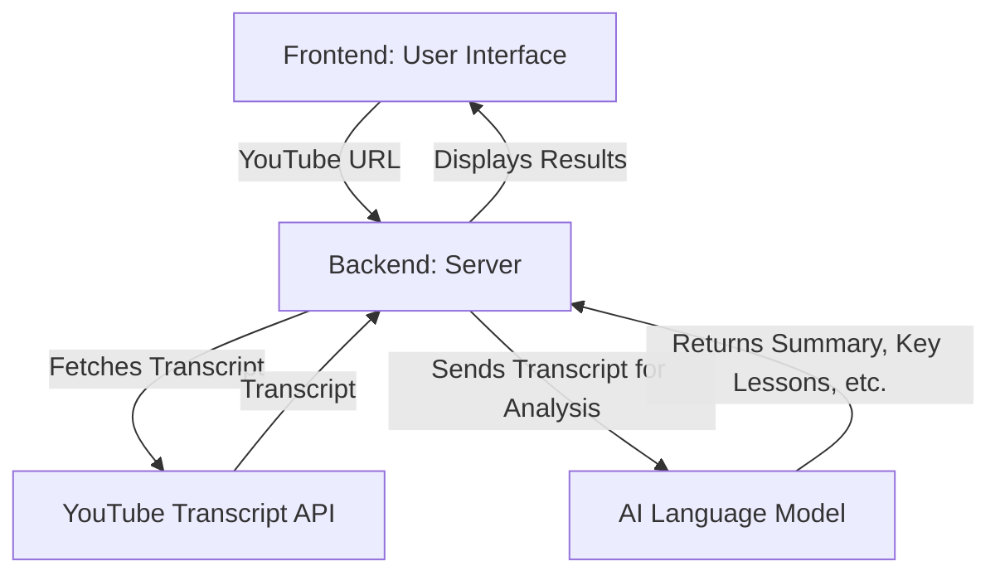

# Project Blueprint: YouTube Summarizer

This document outlines the technical architecture and components of the YouTube Summarizer tool.

## 1. System Architecture

The application follows a simple client-server model.

## 2. Components

### 2.1. Frontend
- **Framework:** None (Plain HTML, CSS, and JavaScript for simplicity)
- **Responsibilities:**
    - Provide a user interface for URL input.
    - Send requests to the backend.
    - Display the processed results received from the backend.

### 2.2. Backend
- **Language:** Python
- **Framework:** Flask (A lightweight web framework)
- **Server:** Waitress (Production-grade WSGI server)
- **Responsibilities:**
    - Serve the frontend static files (HTML, CSS, JS).
    - Expose an API endpoint to receive the YouTube URL.
    - Use the `youtube-transcript-api` library to fetch the video transcript.
    - Construct a detailed prompt for the AI model.
    - Send the transcript and prompt to the Google Generative AI service.
    - Process the AI's response and send it back to the frontend.

### 2.3. External Services
- **YouTube Transcript API:** A Python library to retrieve video transcripts.
- **AI Language Model:** A third-party service for natural language processing (summarization, analysis, etc.).

## 3. Data Flow
1. The user enters a YouTube URL on the frontend and clicks "Summarize".
2. The frontend sends a POST request with the URL to the backend's `/api/summarize` endpoint.
3. The backend receives the URL, extracts the video ID, and fetches the transcript.
4. The backend sends the transcript to the AI model with a prompt asking it to summarize, identify key lessons for a startup founder, and suggest learning points.
5. The AI model returns a structured response (e.g., JSON).
6. The backend formats the response and sends it back to the frontend.
7. The frontend dynamically renders the summary and analysis on the page.